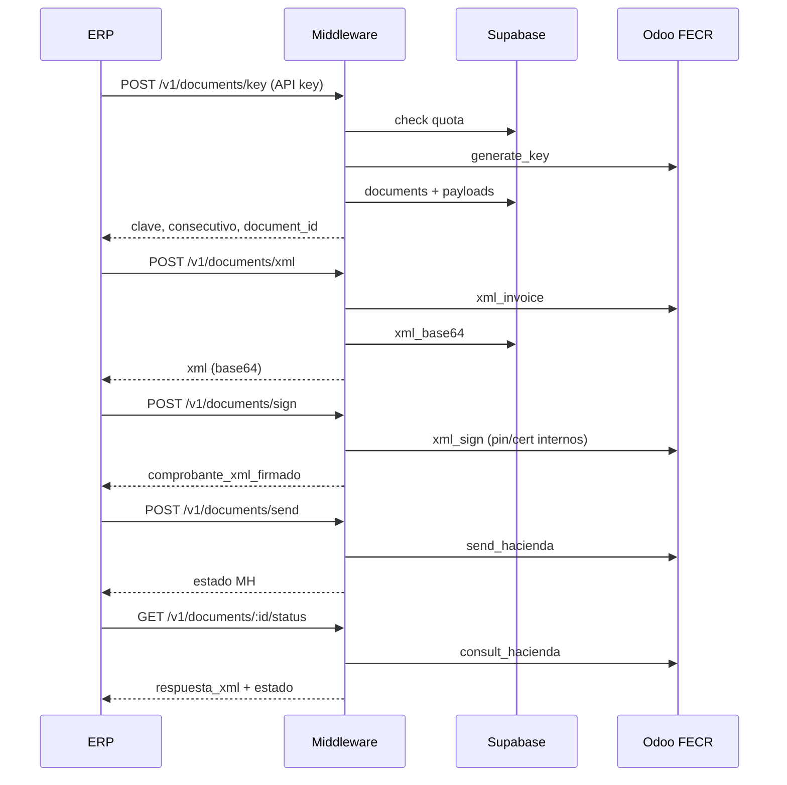

# Arquitectura — Fáctico Middleware

## Decisiones confirmadas

| Tema | Decisión |
|------|----------|
| Base de datos + Auth | Supabase (PostgreSQL + Auth) |
| API pública | JSON REST |
| Hacia Odoo | `multipart/form-data` (adaptador en `_shared/odoo.ts`) |
| Tenancy | Multi-tenant único |
| Aprobación Odoo | Automática (`approved` al crear vía API) |
| Runtime | Deno / Supabase Edge Functions (TypeScript) |

## Flujo FE (MVP por pasos)



## Seguridad

- Terceros: `fc_live_*` API key (hash SHA-256 en BD).
- Panel: JWT Supabase + `profiles.role`.
- Credenciales Odoo/Hacienda: tabla `provider_credentials` (cifrado app-level; MVP prefijo `enc:`).
- RLS: aislamiento por `organization_id`.

## Bootstrap manual (hasta tener panel)

```sql
-- 1. Organización
INSERT INTO organizations (name, tax_id, status)
VALUES ('Cliente demo', '3102802163', 'active')
RETURNING id;

-- 2. Suscripción al plan starter
INSERT INTO subscriptions (organization_id, plan_id, status)
SELECT '<org_id>', id, 'active' FROM plans WHERE name = 'starter';

-- 3. Credenciales (staging) — usar encryptField en producción
INSERT INTO provider_credentials (
  organization_id, environment,
  factico_secret_key_encrypted,
  hacienda_user_encrypted,
  hacienda_password_encrypted,
  certificate_code,
  certificate_pin_encrypted
) VALUES (
  '<org_id>', 'staging',
  'enc:<secret_key_odoo>',
  'enc:<usuario_atv>',
  'enc:<password_atv>',
  '<codigo_certificado>',
  'enc:<pin_p12>'
);

-- 4. API key: generar con generateApiKey() en función admin o script
```

## Fase 2

- `POST /v1/documents/process` (orquestación completa)
- Panel Next.js
- Cifrado AES-256-GCM real
- Storage bucket para XML > 1MB
- Webhooks
